<div align="center">

# 📅 Sistema de Agendamentos

### Plataforma completa para gerenciamento de agendamentos desenvolvida com CodeIgniter 4

[](https://php.net)
[](https://codeigniter.com)
[](https://mysql.com)
[](https://getbootstrap.com)
[](https://bulma.io)
[](LICENSE)

[Funcionalidades](#-funcionalidades) •
[API REST](#-api-rest) •
[Arquitetura](#-arquitetura) •
[Instalação](#-instalação) •
[Screenshots](#-screenshots) •
[Tecnologias](#-tecnologias)

</div>

---

## 🎯 Sobre o Projeto

Sistema de agendamentos **full-stack** desenvolvido com boas práticas de engenharia de software, incluindo:

- **Arquitetura em camadas** (MVC + Service Layer)
- **Autenticação completa** com sessões seguras
- **API REST** completa para integrações externas
- **Notificações** via Email e WhatsApp
- **Relatórios e Dashboards** com gráficos interativos
- **Interface responsiva** com Bootstrap 4 / Bulma CSS
- **Proteção CSRF** automática em formulários

> 💡 Projeto desenvolvido com foco em **código limpo**, **documentação** e **escalabilidade**.

---

## ✨ Funcionalidades

### 🔐 Autenticação & Autorização
- [x] Login/Logout com sessões seguras
- [x] Hash de senhas com `PASSWORD_DEFAULT` (bcrypt)
- [x] Proteção de rotas com Filters
- [x] Sistema de roles (Super Admin, Admin, User)
- [x] Regeneração de sessão após login

### 🏢 Gestão de Unidades
- [x] CRUD completo (Create, Read, Update, Delete)
- [x] Validação de dados com mensagens em português
- [x] Toggle de status (Ativar/Desativar)
- [x] Campos únicos (email, telefone, nome)
- [x] Soft delete para auditoria

### � Área Pública de Agendamentos
- [x] Home page com listagem de unidades
- [x] Wizard de agendamento em 6 passos
- [x] Seleção de unidade, serviço e profissional
- [x] Calendário interativo para escolha de data
- [x] Seleção de horários disponíveis em tempo real
- [x] Confirmação e criação de agendamentos
- [x] Página "Meus Agendamentos" para usuário logado
- [x] Cancelamento de agendamentos
- [x] Interface responsiva com Bulma CSS

### �📊 Interface Administrativa
- [x] Dashboard com métricas
- [x] DataTables com paginação e busca
- [x] Formulários com Bootstrap 4
- [x] Mensagens flash de feedback
- [x] Dropdown de ações por registro

### 🛡️ Segurança
- [x] Proteção CSRF em todos os formulários
- [x] Sanitização de inputs (XSS prevention)
- [x] Validação server-side robusta
- [x] Prepared statements (SQL Injection)
- [x] Escape automático em views

---

## 📸 Screenshots

<details>
<summary><b>🏠 Área Pública - Home & Agendamento</b></summary>

<table>
  <tr>
    <td align="center">
      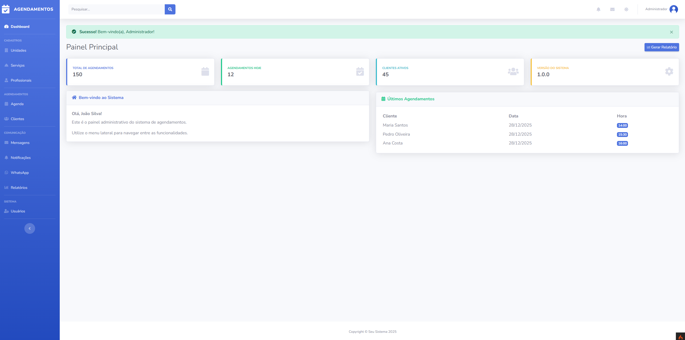
      <br/><em>Página Inicial</em>
    </td>
    <td align="center">
      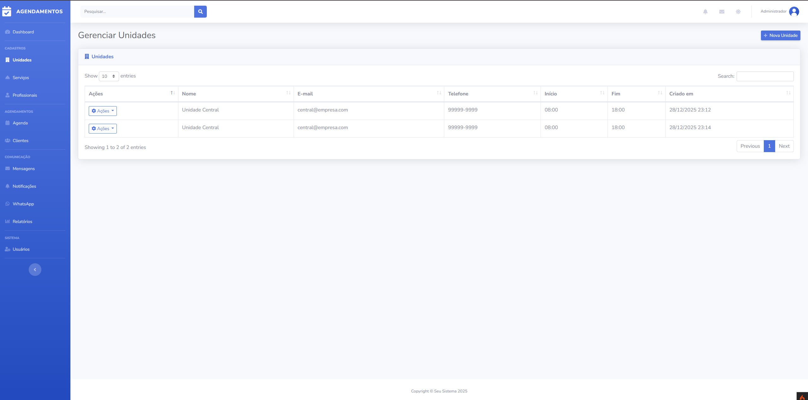
      <br/><em>Seleção de Serviços</em>
    </td>
  </tr>
  <tr>
    <td align="center">
      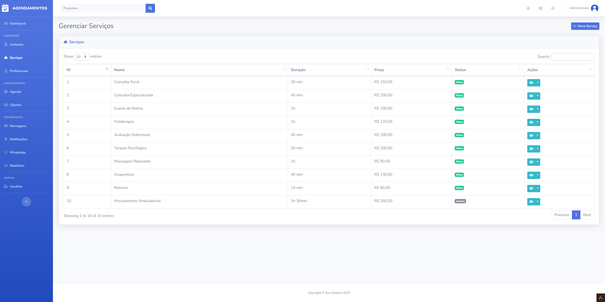
      <br/><em>Escolha de Profissional</em>
    </td>
    <td align="center">
      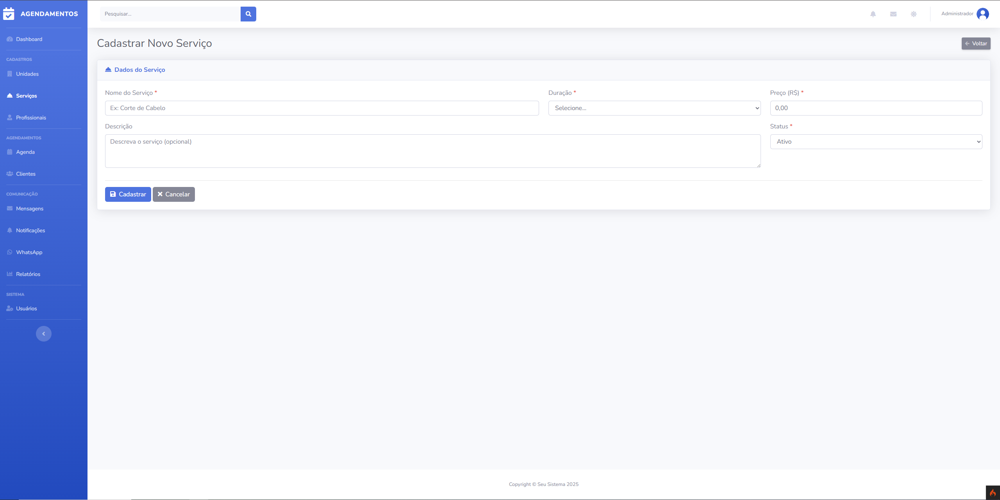
      <br/><em>Calendário de Agendamento</em>
    </td>
  </tr>
  <tr>
    <td align="center">
      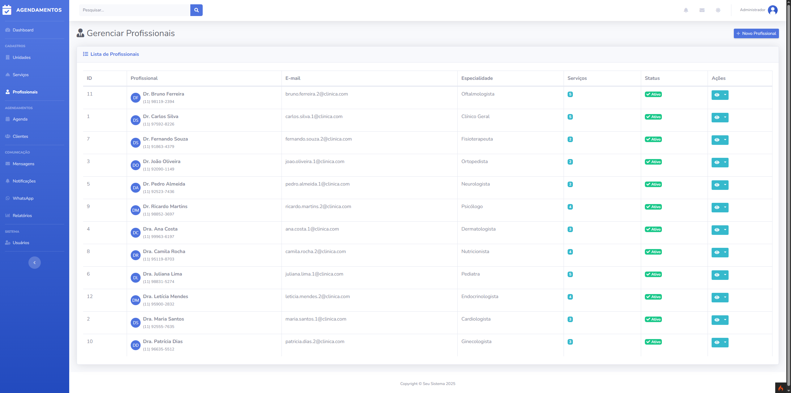
      <br/><em>Seleção de Horários</em>
    </td>
    <td align="center">
      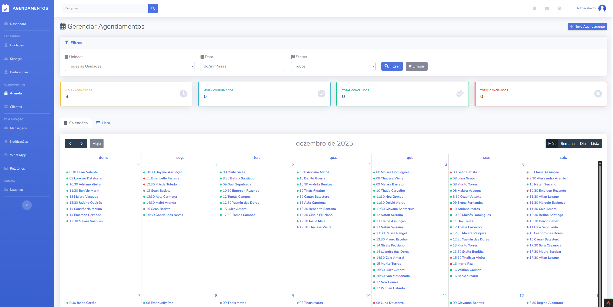
      <br/><em>Confirmação do Agendamento</em>
    </td>
  </tr>
</table>

</details>

<details>
<summary><b>🔐 Autenticação</b></summary>

<table>
  <tr>
    <td align="center">
      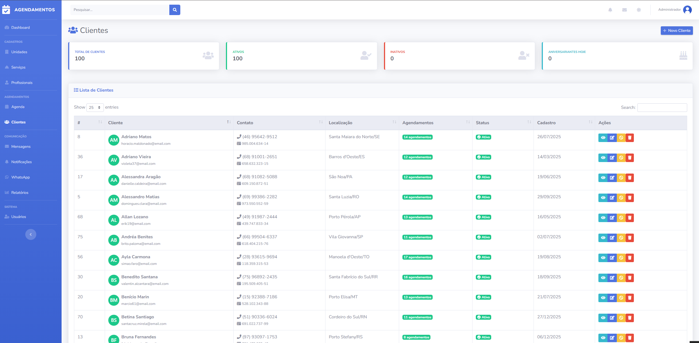
      <br/><em>Tela de Login</em>
    </td>
    <td align="center">
      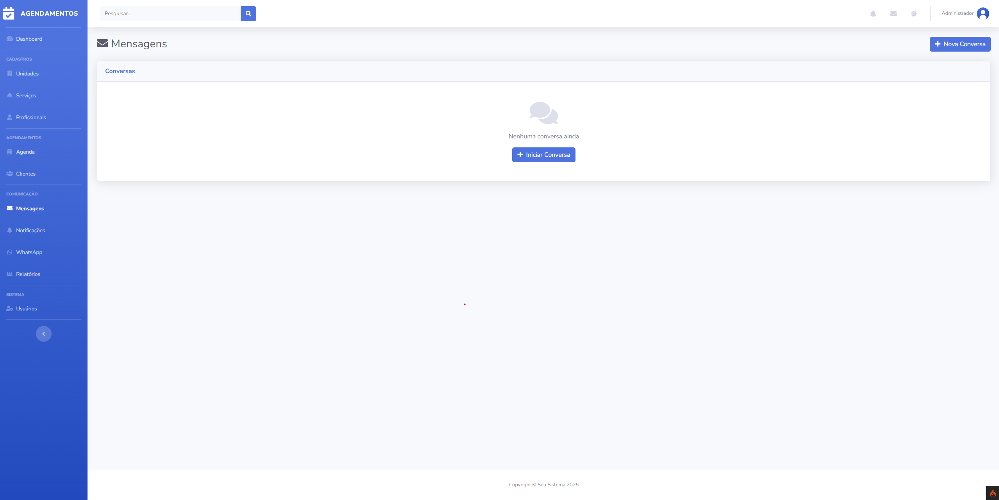
      <br/><em>Tela de Registro</em>
    </td>
  </tr>
</table>

</details>

<details>
<summary><b>📊 Painel Administrativo</b></summary>

<table>
  <tr>
    <td align="center">
      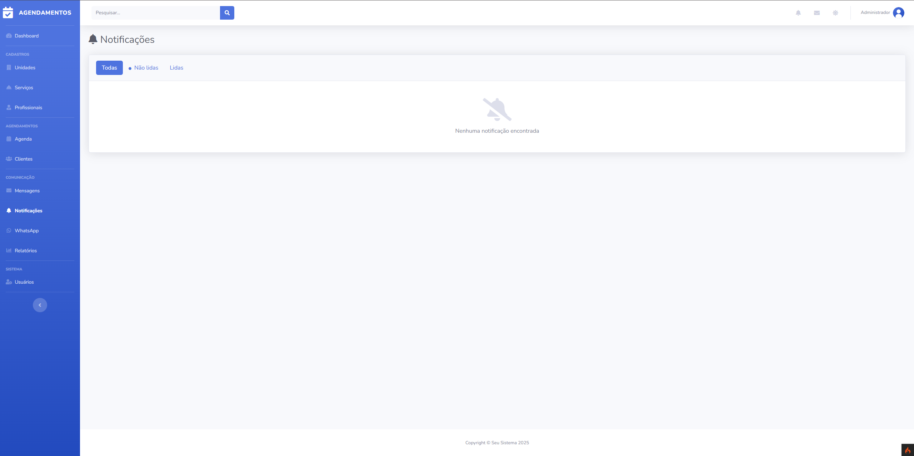
      <br/><em>Dashboard Principal</em>
    </td>
    <td align="center">
      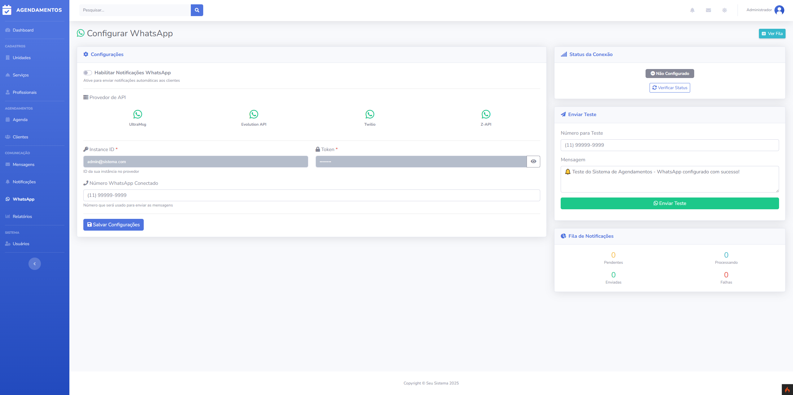
      <br/><em>Gestão de Agendamentos</em>
    </td>
  </tr>
  <tr>
    <td align="center">
      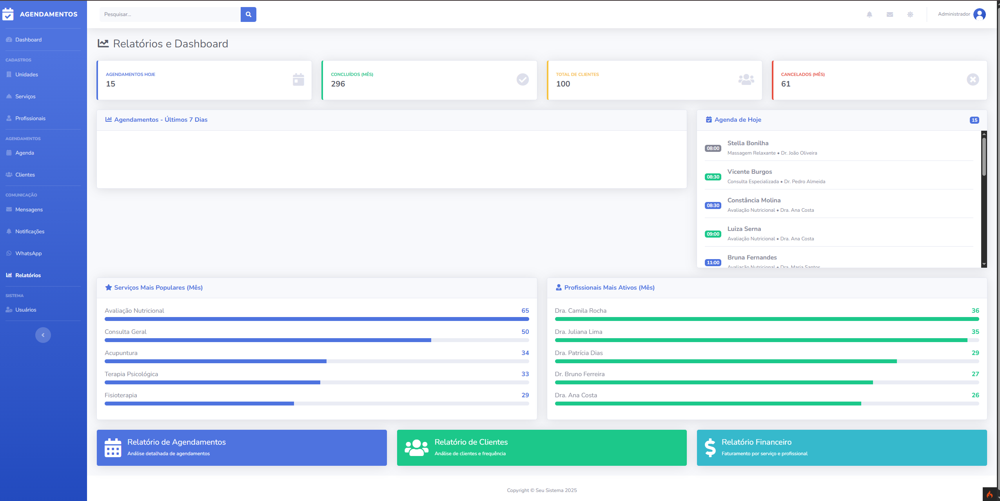
      <br/><em>Gestão de Clientes</em>
    </td>
    <td align="center">
      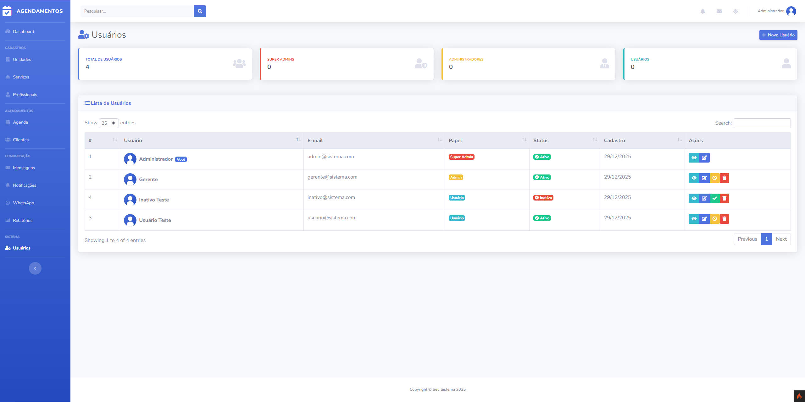
      <br/><em>Gestão de Profissionais</em>
    </td>
  </tr>
  <tr>
    <td align="center">
      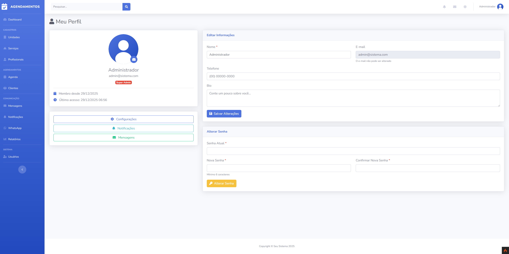
      <br/><em>Gestão de Serviços</em>
    </td>
    <td align="center">
      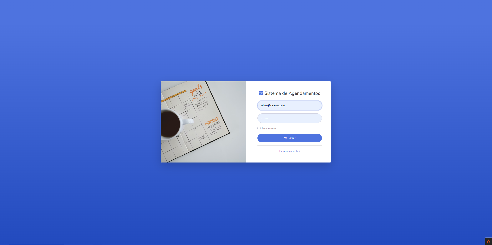
      <br/><em>Gestão de Unidades</em>
    </td>
  </tr>
</table>

</details>

<details>
<summary><b>📈 Relatórios & Configurações</b></summary>

<table>
  <tr>
    <td align="center">
      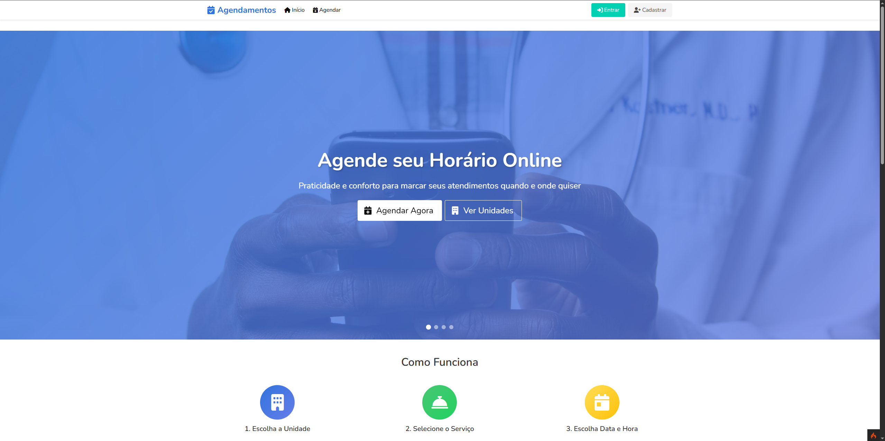
      <br/><em>Relatórios e Gráficos</em>
    </td>
    <td align="center">
      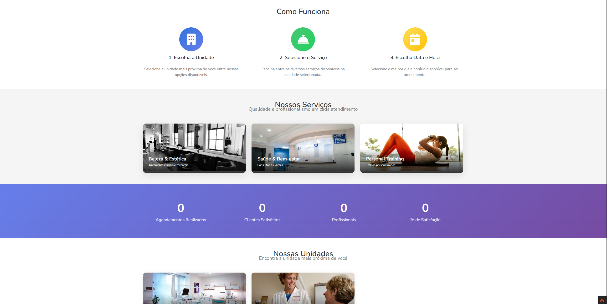
      <br/><em>Configurações do Sistema</em>
    </td>
  </tr>
  <tr>
    <td align="center" colspan="2">
      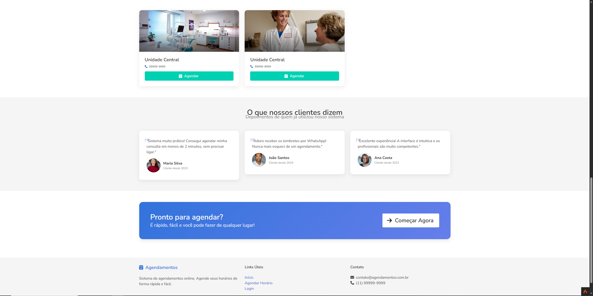
      <br/><em>Perfil do Usuário</em>
    </td>
  </tr>
</table>

</details>

---

## 🏗️ Arquitetura

```
┌─────────────────────────────────────────────────────────────────┐
│                         FRONTEND                                 │
│  ┌──────────────┐  ┌──────────────┐  ┌──────────────┐          │
│  │    Views     │  │   Layouts    │  │  View Cells  │          │
│  │  (Bootstrap) │  │  (SB Admin)  │  │  (Buttons)   │          │
│  └──────────────┘  └──────────────┘  └──────────────┘          │
└─────────────────────────────────────────────────────────────────┘
                              │
                              ▼
┌─────────────────────────────────────────────────────────────────┐
│                        BACKEND                                   │
│  ┌──────────────┐  ┌──────────────┐  ┌──────────────┐          │
│  │  Controllers │──│   Services   │──│    Models    │          │
│  │  (HTTP/CRUD) │  │(Business Logic│  │  (Database)  │          │
│  └──────────────┘  └──────────────┘  └──────────────┘          │
│         │                                     │                  │
│         ▼                                     ▼                  │
│  ┌──────────────┐                     ┌──────────────┐          │
│  │   Filters    │                     │   Entities   │          │
│  │    (Auth)    │                     │   (Domain)   │          │
│  └──────────────┘                     └──────────────┘          │
└─────────────────────────────────────────────────────────────────┘
                              │
                              ▼
┌─────────────────────────────────────────────────────────────────┐
│                        DATABASE                                  │
│  ┌──────────────┐  ┌──────────────┐  ┌──────────────┐          │
│  │    Users     │  │    Units     │  │   (future)   │          │
│  │  (Auth/RBAC) │  │ (Scheduling) │  │  Services,   │          │
│  │              │  │              │  │ Appointments │          │
│  └──────────────┘  └──────────────┘  └──────────────┘          │
└─────────────────────────────────────────────────────────────────┘
```

### 📁 Estrutura de Diretórios

```
app/
├── Cells/              # View Cells (componentes reutilizáveis)
│   └── ButtonsCell.php
├── Config/             # Configurações do framework
│   ├── Filters.php     # Registro de filtros (Auth, CSRF)
│   └── Routes.php      # Definição de rotas
├── Controllers/        # Controladores HTTP
│   ├── AuthController.php
│   └── Super/          # Área administrativa
│       └── UnitsController.php
├── Database/
│   ├── Migrations/     # Estrutura do banco
│   └── Seeds/          # Dados iniciais
├── Entities/           # Objetos de domínio
│   ├── MyBaseEntity.php
│   ├── Unit.php
│   └── User.php
├── Filters/            # Middlewares
│   └── AuthFilter.php
├── Helpers/            # Funções auxiliares
│   └── general_helper.php
├── Libraries/          # Serviços de negócio
│   ├── MyBaseService.php
│   └── UnitService.php
├── Models/             # Acesso a dados
│   ├── UnitModel.php
│   └── UserModel.php
└── Views/              # Templates
    └── Back/
        ├── Auth/       # Telas de login
        ├── Layout/     # Layout master
        └── Units/      # CRUD de unidades
```

---

## 🚀 Instalação

### Pré-requisitos

- PHP 8.2 ou superior
- Composer
- MySQL 8.0 ou MariaDB 10.4+
- Extensões PHP: intl, mbstring, json, mysqlnd

### Passo a Passo

```bash
# 1. Clone o repositório
git clone https://github.com/seu-usuario/agendamentos.git
cd agendamentos

# 2. Instale as dependências
composer install

# 3. Configure o ambiente
cp env .env

# 4. Edite o arquivo .env com suas configurações
# - CI_ENVIRONMENT = development
# - app.baseURL = 'http://localhost:8080/'
# - database.default.hostname = localhost
# - database.default.database = agendamentos
# - database.default.username = root
# - database.default.password = sua_senha

# 5. Execute as migrations
php spark migrate

# 6. Crie os usuários iniciais
php spark db:seed UserSeeder

# 7. Inicie o servidor de desenvolvimento
php spark serve
```

## 🛠️ Tecnologias

### Backend
| Tecnologia | Versão | Descrição |
|------------|--------|-----------|
| PHP | 8.2+ | Linguagem de programação |
| CodeIgniter | 4.6.4 | Framework MVC |
| MySQL | 8.0 | Banco de dados relacional |

### Frontend
| Tecnologia | Versão | Descrição |
|------------|--------|-----------|
| Bootstrap | 4.6 | Framework CSS (área administrativa) |
| Bulma | 0.9.4 | Framework CSS (área pública) |
| SB Admin 2 | 2.0 | Template administrativo |
| jQuery | 3.6 | Biblioteca JavaScript |
| DataTables | 1.11 | Plugin para tabelas |
| Font Awesome | 6.5 | Ícones vetoriais |

### Ferramentas
| Ferramenta | Descrição |
|------------|-----------|
| Composer | Gerenciador de dependências PHP |
| PHPUnit | Framework de testes |
| Spark CLI | CLI do CodeIgniter |

---

## 📋 Roadmap

- [x] Sistema de autenticação
- [x] CRUD de Unidades
- [x] CRUD de Serviços
- [x] CRUD de Profissionais
- [x] Sistema de Agendamentos
- [x] Calendário interativo (FullCalendar)
- [x] CRUD de Clientes
- [x] CRUD de Usuários
- [x] **Área Pública de Agendamentos**
  - [x] Template com Bulma CSS
  - [x] Wizard de agendamento (6 passos)
  - [x] Seleção de unidade, serviço, profissional
  - [x] Calendário interativo para escolha de data
  - [x] Seleção de horários disponíveis
  - [x] Confirmação e criação de agendamentos
  - [x] Página "Meus Agendamentos"
  - [x] Cancelamento de agendamentos
  - [x] Hero slider com imagens Unsplash
  - [x] Estatísticas animadas
  - [x] Seção de depoimentos
- [x] **Notificações**
  - [x] Email de confirmação de agendamento
  - [x] Lembrete 24h antes (CRON)
  - [x] Notificação de cancelamento
  - [x] Notificação de alteração de status
  - [x] Integração com WhatsApp (Evolution API / Twilio / Z-API)
- [x] **API REST Completa**
  - [x] Endpoints para Unidades, Serviços, Profissionais
  - [x] Endpoints para Agendamentos e Clientes
  - [x] Paginação e filtros
  - [x] Respostas JSON padronizadas
- [x] **Relatórios e Dashboards**
  - [x] Dashboard com KPIs
  - [x] Relatório de agendamentos
  - [x] Relatório de clientes
  - [x] Relatório financeiro
  - [x] Gráficos interativos (Chart.js)
  - [x] Exportação CSV
- [x] **Seeders de Dados**
  - [x] Seeder de Unidades
  - [x] Seeder de Serviços
  - [x] Seeder de Profissionais
  - [x] Seeder de Clientes (Faker)
  - [x] Seeder de Agendamentos
- [x] **Multi-tenant (múltiplas empresas)**
  - [x] Tabela de Tenants (empresas)
  - [x] Identificação por subdomain/path/domain
  - [x] TenantFilter para isolamento de dados
  - [x] TenantService global
  - [x] CRUD de Empresas (Super Admin)
  - [x] Sistema de planos (free/basic/pro/enterprise)
  - [x] Limites configuráveis (usuários, unidades, agendamentos)
- [x] **Pagamentos online (MercadoPago)**
  - [x] Checkout Pro (redirect)
  - [x] PIX com QR Code
  - [x] Cartão de Crédito (tokenização)
  - [x] Boleto Bancário
  - [x] Webhook para confirmação automática
  - [x] Tabela de Payments
  - [x] Telas de sucesso/falha/pendente
- [x] **App mobile (PWA)**
  - [x] manifest.json completo
  - [x] Service Worker com cache strategies
  - [x] Offline page
  - [x] Ícones em vários tamanhos
  - [x] Push notifications (estrutura)
  - [x] Instalação na home screen

---

## 🔌 API REST

### Base URL
```
/api/v1
```

### Endpoints Disponíveis

#### Unidades
| Método | Endpoint | Descrição |
|--------|----------|-----------|
| GET | `/units` | Lista todas as unidades |
| GET | `/units/{id}` | Retorna uma unidade |
| POST | `/units` | Cria uma unidade |
| PUT | `/units/{id}` | Atualiza uma unidade |
| DELETE | `/units/{id}` | Remove uma unidade |

#### Serviços
| Método | Endpoint | Descrição |
|--------|----------|-----------|
| GET | `/services` | Lista serviços (filtro: ?unit_id=) |
| GET | `/services/{id}` | Retorna um serviço |
| POST | `/services` | Cria um serviço |
| PUT | `/services/{id}` | Atualiza um serviço |
| DELETE | `/services/{id}` | Remove um serviço |

#### Profissionais
| Método | Endpoint | Descrição |
|--------|----------|-----------|
| GET | `/professionals` | Lista profissionais |
| GET | `/professionals/{id}` | Retorna um profissional |
| GET | `/professionals/{id}/availability` | Disponibilidade |
| POST | `/professionals` | Cria um profissional |
| PUT | `/professionals/{id}` | Atualiza um profissional |
| DELETE | `/professionals/{id}` | Remove um profissional |

#### Agendamentos
| Método | Endpoint | Descrição |
|--------|----------|-----------|
| GET | `/appointments` | Lista agendamentos (com filtros) |
| GET | `/appointments/{id}` | Retorna um agendamento |
| GET | `/appointments/available-slots` | Horários disponíveis |
| POST | `/appointments` | Cria um agendamento |
| POST | `/appointments/{id}/confirm` | Confirma agendamento |
| POST | `/appointments/{id}/complete` | Conclui agendamento |
| POST | `/appointments/{id}/cancel` | Cancela agendamento |
| PUT | `/appointments/{id}` | Atualiza agendamento |
| DELETE | `/appointments/{id}` | Cancela agendamento |

#### Clientes
| Método | Endpoint | Descrição |
|--------|----------|-----------|
| GET | `/clients` | Lista clientes (paginado) |
| GET | `/clients/search?q=` | Busca clientes |
| GET | `/clients/{id}` | Retorna um cliente |
| GET | `/clients/{id}/appointments` | Agendamentos do cliente |
| POST | `/clients` | Cria um cliente |
| PUT | `/clients/{id}` | Atualiza um cliente |
| DELETE | `/clients/{id}` | Remove um cliente |

### Formato de Resposta

```json
{
    "success": true,
    "message": "Operação realizada com sucesso",
    "data": { ... }
}
```

---

## 🧪 Testes

```bash
# Executar todos os testes
./vendor/bin/phpunit

# Executar com cobertura
./vendor/bin/phpunit --coverage-html reports/
```

---

## 🤝 Contribuição

Contribuições são bem-vindas! Por favor, leia o guia de contribuição antes de submeter PRs.

1. Fork o projeto
2. Crie sua branch de feature (`git checkout -b feature/AmazingFeature`)
3. Commit suas mudanças (`git commit -m 'Add some AmazingFeature'`)
4. Push para a branch (`git push origin feature/AmazingFeature`)
5. Abra um Pull Request

---

## 📄 Licença

Este projeto está sob a licença MIT. Veja o arquivo [LICENSE](LICENSE) para mais detalhes.

---

## 👤 Autor

Desenvolvido com ❤️ por **Tavilo Breno**

[](https://linkedin.com/in/tavilo-breno)
[](https://github.com/TaviloBreno)
[](mailto:tavilo.breno10@gmail.com)

---

<div align="center">

**⭐ Se este projeto foi útil para você, considere dar uma estrela!**

</div>
